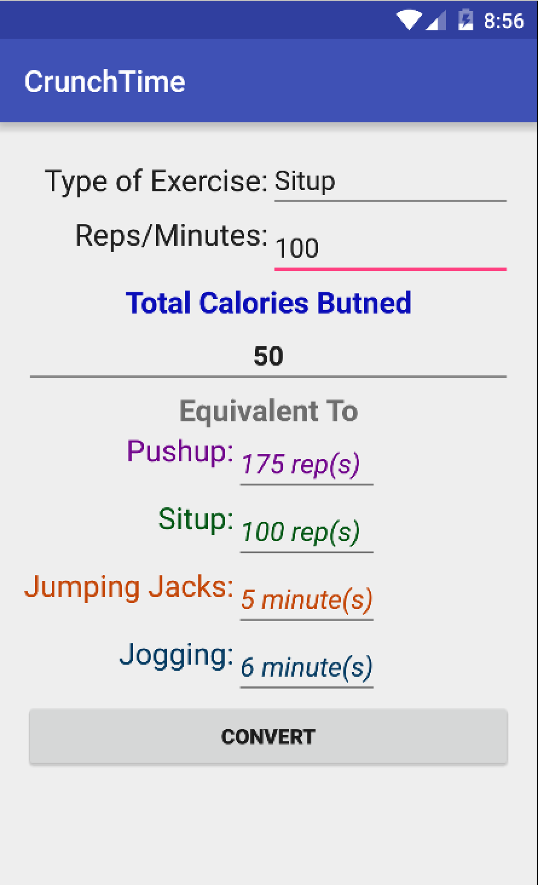

# PROG 01: Crunch Time

This app is a simple calories burned conversion app. Users can input the kind of exercises they do, and how much they do. The app will automatically convert how many calories burned, and the equivalence to other exercises.

## Authors

Chang Liu
([liu.chang@berkeley.edu](mailto:liu.chang@berkeley.edu))

## Demo Video

See Crunch Time by Ricky  (https://youtu.be/pQ6UHNCv3hs)

## Screenshots

## Acknowledgments
Thank you for Jingyi's great discussion section!
